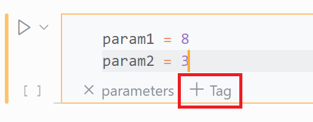

# Jupyter Cell Tags support in VS Code

This extension provides support for notebook cell tags in Visual Studio Code for workng with tools like [`papermill`](https://github.com/nteract/papermill), [`nbconvert`](https://github.com/jupyter/nbconvert), [`nbgrader`](https://github.com/jupyter/nbgrader) and many more. Support for adding slide types to notebook cells are provided by the [Jupyter Slide Show](https://marketplace.visualstudio.com/items?itemName=ms-toolsai.vscode-jupyter-slideshow) extension.

Features:
- Add a tag to the cell you're on by opening the Command Palette (`Cmd+Shift+P`) and selecting **Add Cell Tag** or by clicking **+ Tag** on the cell 
- Add multiple tags to the cell you're on by opening the Command Palette (`Cmd+Shift+P`) and selecting **Jupyter: Focus on Cell Tags View** and clicking on **+** 
- Modify tags in the notebook's metadata (JSON format) by opening the Command Palette (`Cmd+Shift+P`) and selecting **Edit Cell Tags (JSON)** or by clicking out to it from the Cell Tags View 

This extension comes with the [Jupyter extension for Visual Studio Code](https://marketplace.visualstudio.com/items?itemName=ms-toolsai.jupyter) and can be disabled or uninstalled.

## Contributing

This project welcomes contributions and suggestions.  Most contributions require you to agree to a
Contributor License Agreement (CLA) declaring that you have the right to, and actually do, grant us
the rights to use your contribution. For details, visit https://cla.opensource.microsoft.com.

When you submit a pull request, a CLA bot will automatically determine whether you need to provide
a CLA and decorate the PR appropriately (e.g., status check, comment). Simply follow the instructions
provided by the bot. You will only need to do this once across all repos using our CLA.

This project has adopted the [Microsoft Open Source Code of Conduct](https://opensource.microsoft.com/codeofconduct/).
For more information see the [Code of Conduct FAQ](https://opensource.microsoft.com/codeofconduct/faq/) or
contact [opencode@microsoft.com](mailto:opencode@microsoft.com) with any additional questions or comments.

## Trademarks

This project may contain trademarks or logos for projects, products, or services. Authorized use of Microsoft 
trademarks or logos is subject to and must follow 
[Microsoft's Trademark & Brand Guidelines](https://www.microsoft.com/en-us/legal/intellectualproperty/trademarks/usage/general).
Use of Microsoft trademarks or logos in modified versions of this project must not cause confusion or imply Microsoft sponsorship.
Any use of third-party trademarks or logos are subject to those third-party's policies.
